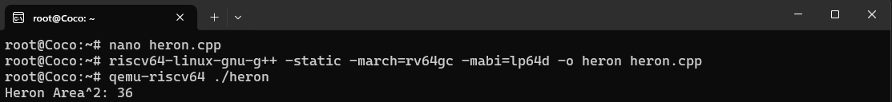

https://github.com/Shristi-78/custom-instruction/

# custom-instruction

Implementing a true custom instruction in RISC-V (i.e., one that can be executed by QEMU and compiled using GCC), specifically to compute Heron’s formula .

##How to Build

###Install RISC-V toolchain:

```bash
sudo apt install g++-riscv64-linux-gnu qemu-user
```
Compile using the Makefile:

```bash
make heron
```

Or manually:

```bash
riscv64-linux-gnu-g++ -static -march=rv64gc -mabi=lp64d -o heron heron.cpp
```

Run with QEMU:

```bash
qemu-riscv64 ./heron
```
## Sample Output


